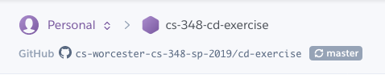
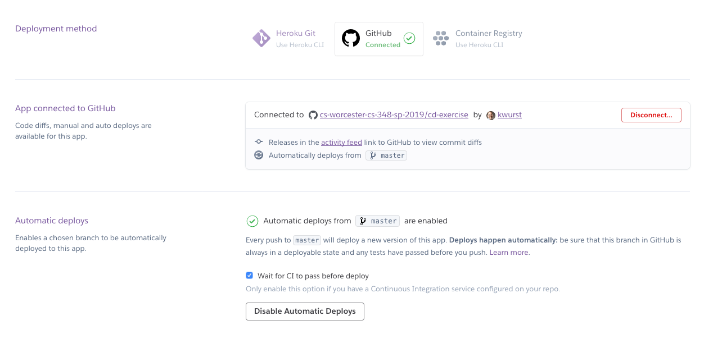
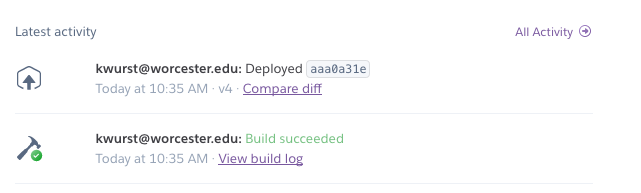

[](https://travis-ci.org/cs-worcester-cs-348-sp-2019/cd-exercise.svg?branch=master)

*Version 2019-Spring-1.0-Final, Revised 21 April 2019*
### *CS-348 01, 02, 03 &mdash; Spring 2019*

# Continuous Deployment Exercise

This exercise is similar to the Continuous Integration Exercise, but takes it one step further and deploys the working code, as a web app running on the [Heroku](https://heroku.com) service. Heroku lets you continuously deploy apps as soon as the code has been changed, built, tested, reviewed and merged.

## Set up your Repository

### Fork the Repository
[https://github.com/cs-worcester-cs-348-sp-2019/cd-exercise](https://github.com/cs-worcester-cs-348-sp-2019/cd-exercise)

### 1. Clone the Repository

### 2. Add the original repository as an upstream remote

### 3. Build with Gradle

```
gradlew clean build
```
OR 

```
gradle clean build
```

### 4. View Travis CI Builds
[https://travis-ci.org/cs-worcester-cs-348-sp-2019/cd-exercise/](https://travis-ci.org/cs-worcester-cs-348-sp-2019/cd-exercise)

Be sure to look at the tabs `Current`, `Branches`, `Build History`, and `Pull Requests`.

### 5. View Heroku Deployment
The most current merged build is deployed to 
[https://cs-348-cd-exercise.herokuapp.com/](https://cs-348-cd-exercise.herokuapp.com/)

### 6. Heroku Configuration
***You do not need to create a Heroku account for this exercise. Just read the information and view the screen shots below.***

Heroku requires that you make an account. You can deploy applications for free as long as you are willing to have Heroku shut them down after a period of inactivity. There will be a delay for them to start back up (about 20 seconds). You can keep applications running by paying.

You can connect your Heroku account to a GitHub repository:


And set Heroku to automatically deploy from the master branch (after CI has passed):


The dashboard will show you the status of the latest activity:


### 7. Look at the `Procfile` File
The `Procfile` is used by Heroku to determine how to run the program:

```
web: java -Dserver.port=$PORT $JAVA_OPTS -jar build/libs/cs-348-cd-exercise.jar
```

It is telling Heroku to execute the jar file as a web process, passing it a server port to listen for connections on.

## Trying out the Continuous Integration/Continuous Deployment process

***This is the same process as the CI Exercise with the addition of checking the deployed application to see that the changes show up.***

### Modify the CDExercise to Include your Name

I am *intentionally* not repeating all of the Git and GitHub commands for you here. You should be getting used to what you need to do. If you cannot remember how, do the following steps ***in order***:

1. Look at past in-class exercises and homework assignments.
2. Ask your classmates for help.
3. Ask me for help.
 
### 1. Create an `add-yourname` branch, and switch to that branch

Replace `yourname` with your own name.

### 2. Edit the code
Based on the last digit of your WSU Student ID, edit the appropriate `EndsWith` class. For example, my ID ends with `2`, so I edited the `EndsWith2.java` file. Look at `EndsWith2.java` as an example for what to do.

***Note that I have changed the code to use `, ` as a separator between names instead of `\n` because of the way the HTML display works.***

### 3. Build and test the code with Gradle

The test will fail because you have not updated the test file for the class you edited.

Go update the test for the code you just wrote and test again.

***Note that I have changed the code to use `, ` as a separator between names instead of `\n` because of the way the HTML display works.***

### 4. Run the application

```
gradle bootrun
```

Wait until you see this message:

```
2019-04-22 07:31:36.712  INFO 33423 --- [  restartedMain] CS_348_SP_2019.CDExercise.Application    
: Started Application in 2.603 seconds (JVM running for 3.13)
```

View the running application on [http://localhost:8080](http://localhost:8080)

### 5. Add your code and commit your changes

### 6. Before pushing your changes, make sure your repository is up-to-date with upstream

Pull recent changes from your classmates

Resolve any conflicts

### 7. Push changes
 
Make sure you are pushing to your branch.

### 8. Make a pull request to have your change merged into the original repository

Note that you cannot make a pull request until Travis has run your build, and your tests are successful.

### 9. Go to the original repository and approve someone else's pull request

### 10. Check Travis

### 11. Check the running app on Heroku
[https://cs-348-cd-exercise.herokuapp.com/](https://cs-348-cd-exercise.herokuapp.com/)


# Reference Material

## Git Workflow Reminder

> 1. Add the change
> 2. Pull any changes that have ocurred since the last pull, and correct merge conflicts
> 3. Commit the change, with a message describing the change.
> 4. Push the change
> 5. Make a pull request to have the change merged into the original repository

## General Bash  Hints

* To view hidden files (starting with .) in Bash, type `ls -al`

## Copyright and License
#### &copy; 2019 Karl R. Wurst, Worcester State University

This work is licensed under the Creative Commons Attribution-ShareAlike 4.0 International License. To view a copy of this license, visit <a href="http://creativecommons.org/licenses/by-sa/4.0/" target="_blank">http://creativecommons.org/licenses/by-sa/4.0/</a> or send a letter to Creative Commons, 444 Castro Street, Suite 900, Mountain View, California, 94041, USA.

